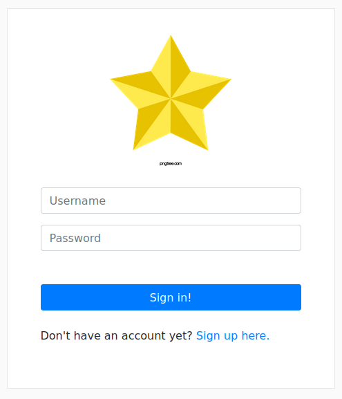

# Portfolio.com

This is a project for people who wants to create a portfolio and does not how to do it, 
with this project just has to create an user, put all the photos, information, descriptions and does it, the people could show his/her profile or portfolio to the entire world.



## Dependencies
Python 3
Django

## Usage
```shell
python3 -m venv .env
source .env/bin/activate
pip install -r requirements.txt
```

```python
python manage.py makemigrations
python manage.py migrate
python manage.py runserver
